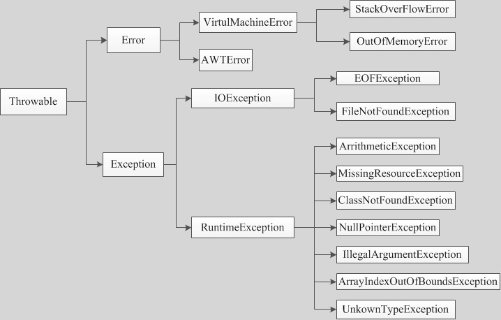

# APP Crash 研究报告

## 1、研究背景

### 1.1、什么是Crash

Crash 即闪退，多指在移动设备中，在打开或运行应用程序过程中出现突然中断的情况。

### 1.2、为什么会Crash

由于出现异常且没有被应用程序捕捉住引起进程被杀。

### 1.3、Crash的影响

- Crash用户可感知，也正是如此可能会引起投诉甚至用户流失
- 在重要流程（如启动）出现Crash会导致用户无法使用整个app
- 很可能需要重新发版本并强制升级，最终会导致用户流失

### 1.4、Crash分类（见类图）

- Throwable 有两个主要的子类 Error 和 Exception
  Error:这种异常被设计成不被捕捉，产生于JVM自身(OutOfMerroyError)
  Exception:能被程序本身所处理
  Exception 分为运行时异常（隐式异常） 和非运行时异常（显式异常）
  运行时异常： java编译器不会检查它，一般由程序逻辑错误引起的，程序应该从逻辑角度尽可能的避免这类异常 （如 空指针）
  非运行异常： 从程序语法角度上必须处理的异常 不处理则编译不通过（如 IOException）

  

## 2、研究目标

通过研究具体Exception，分析发生Exception的原因，从而找到预防Exception的办法。

## 3、研究范围

常见的Exception以及听云上出现概率高的Exception，详见附件1-Android_Exception列表。

## 4、具体分析

以下是对具体Exception进行分析，并提出相应预防方法。

### 4.1、DataFormatException

继承于java.lang.Exception

#### case 1

- 堆栈关键字：

java.util.zip.DataFormatException: incorrect header check

- 发生原因：

在压缩字符串时，使用Inflater.inflate(), 当压缩的数据的内容不为Base64编码或者数据内容为空，抛出此异常。

- 原因分析：

使用Inflater.inflate()压缩数据到指定的缓冲区时, 压缩的数据的内容需要为合法的Base64编码并且数据内容不可以为空。

- 预防措施：

检查需要压缩的数据内容，不为空，并且为Base64编码（自行判断）。
注：
Base64编码之后的字符串具有以下特点：

- 字符串只可能包含A-Z，a-z，0-9，+，/，=字符
- 字符串长度是4的倍数
- =只会出现在字符串最后，可能没有或者一个等号或者两个等号

#### case 2

- 堆栈关键字：

java.util.zip.DataFormatException: stream error

- 发生原因：

在Android 4.4.4 使用GZipUtils工具类，进行GZip压缩时报错

- 原因分析：

由于同时使用gos.finish()  gos.flush()，导致crash，关闭了流后，继续清空缓冲区不能都同时执行。在高版本上，系统优化了相关代码。

- 预防措施： 

去掉其中一个gos.finish()  gos.flush()

### 4.2、FileNotFoundException

继承于java.io.IOException

#### case 1

- 堆栈关键字：

java.io.FileNotFoundException: xxx.text (Read-only file system)

- 发生场景：

操作文件时，没有配置文件读写权限

- 发生原因：

没有打开文件读写权限

- 原因分析：

没有打开文件读写权限，系统读取不到相关文件

- 预防措施：

需要在mainnifest打开文件允许读写权限

#### case 2

- 堆栈关键字：

java.io.FileNotFoundException: .\xx\xx.text (系统找不到指定的路径)

- 发生场景：

读取某个路径下面的文件时，出错

- 发生原因：

当前指定的文件不存在或者目录不存在

- 原因分析：

当前指定的文件不存在或者目录不存在

- 预防措施： 

进行文件读写之前，首先检查文件和目录是否存在，如果存在，则继续。

#### case 3

- 堆栈关键字：

java.io.FileNotFoundException: .\xx\xx(拒绝访问)

- 发生场景：

读取某个路径下面的文件时，出错

- 发生原因：

由于访问了文件目录并没有访问文件

- 原因分析：

因为访问了文件目录并没有访问文件

- 预防措施： 

进行文件读写之前，首先检查文件填写的路径，一定要到具体的文件

### 4.3、CloneNotSupportedException

继承于java.lang.Exception

- 堆栈关键字：

java.lang.CloneNotSupportedException

- 发生场景：

使用Object类中的clone方法

- 发生原因：

没有实现Cloneable接口的实例

- 原因分析：

在没有实现Cloneable接口的实例上，调用Object的clone方法

- 预防措施： 

使用Object的clone方法时，需要实现Cloneable接口的实例，并且无论目标类是否实现了Cloneable接口，只要调用到了Object.clone()，比如通过super.clone()，那么就必须处理或者抛出CloneNotSupportedException，因为Object.clone()有throws这个异常。

**补充说明：**

Object.clone()按照如下步骤执行：

- (1) 检查执行此方法的当前类有没有应用Clonable接口，如果没有，抛出CloneNotSupportedException异常。
- (2) 如果当前类有应用Clonable接口，则为当前类创建一个新对象，并将原对象中的所有字段进行一次浅层拷贝（通过赋值进行）。所以如果一个目标类应用了Clonable接口但并未重写clone()方法，它“看起来”仍然可以克隆。为什么是“看起来”下面会解释。
- (3) 为什么应用了Cloneable接口的类通常还必须重写一个public的clone()方法？这里有两个原因：
- 1) 如果不重写，由于Object.clone()是proteced属性，所以这个clone()方法将无法在外部被调用，更精确地说，无法在目标类之外的任何地方调用。这样就使得克隆失去了用武之地。
- 2) Object.clone()毕竟只是提供了浅层拷贝，对于基本类型的字段，可以说它成功克隆了。但对于对象型字段，它并没有实现克隆的功能，仅仅做了一个赋值。

### 4.4、BufferOverflowException

继承于java.lang.RuntimeException

- 堆栈关键字：

java.nio.BufferOverflowException

- 发生场景：

使用ByteBuffer.allocate(n)分配n字节长度，但是写入数据时ByteBuffer.put(str)，数据长度超过了n长度。

- 发生原因：

由于写入长度超过了允许的长度，溢出了

- 原因分析：

使用ByteBuffer.allocate(n)分配n字节长度，但是写入数据时ByteBuffer.put(str)，数据长度超过了n长度，写入长度超过了允许的长度。

- 预防措施： 

进行写入之前，先判断写入的长度和允许的长度进行比较，保证写入的长度在允许的长度范围之内，如果不在合法范围之内，可以修改允许的长度，这样保证写入的长度合法。

### 4.5、NoSuchMethodException

继承于java.lang.ReflectiveOperationException

- 堆栈关键字：

java.lang.NoSuchMethodException

- 发生场景：

反射时使用getMethod获取某个方法

- 发生原因：

反射时getMethod只能调用public声明的方法

- 原因分析：

**错误原因：**

- 1、	错写方法名
- 2、	方法定义为private或者protect类型
- 3、	参数传递错误，参数传递顺序错误
- 预防措施： 
- 1、	检查代码中是否有此方法
- 2、	检查该方法是否为public
- 3、	检查此方法是否传递了参数，确认是否有问题

### 4.6、InflateException

继承于java.lang.RuntimeException

- 堆栈关键字：

android.view.InflateException

- 发生场景：

自定义布局View使用，文件名写错误，导致类名找不到，引起布局文件找不到导致异常。发生原因：
xml中使用的View组件名字和代码中的名字不一致导致

- 原因分析：

自定义布局View使用，文件名写错误或者引用的名字，不是全路径的名字，导致类名找不到，引起布局文件找不到导致异常。

- 预防措施： 
- 1)	自定义组件需要注意构造函数，默认都需要带有Context和 AttributeSet构造函数。
- 2)	如果有自定义属性，需要引入工程包名，否则自定义属性会报错。
- 3)	检查XML语法错误。
- 4)	检查布局中自定义的路径名是否正确。
- 5)	检查布局中background的样式是否引用了不兼容API Level的样式，通常在4.4系统容易遇到一些只兼容21不兼容19的样式问题。
- 6)	使用ImageView时，注意图片不要放错文件夹，就是对应分辨率的文件夹，特别需要注意默认的drawable文件夹一定要存在，并且有图片资源。

### 4.7、EnumConstantNotPresentException

继承于java.lang.RuntimeException

- 堆栈关键字：

java.lang.EnumConstantNotPresentException

- 发生场景：

当应用程序尝试按名称访问枚举常量并且枚举类型不包含具有指定名称的常量时抛出。

- 发生原因：

如果注释中的枚举常量不再出现在枚举类型中，则尝试读取枚举值成员将导致EnumConstantNotPresentException。

- 原因分析：

当应用程序尝试按名称访问枚举常量并且枚举类型不包含具有指定名称的常量时抛出。类似地，如果注释中的枚举常量不再出现在枚举类型中，则尝试读取枚举值成员将导致EnumConstantNotPresentException。

- 预防措施： 

使用时需要注意枚举常量需要在枚举类型中。

### 4.8、FileUriExposedException

继承于java.lang.RuntimeException

- 堆栈关键字：

android.os.FileUriExposedException

- 发生场景：
- 1) targetSdkVersion 高于等于24时，使用相机拍照保存时出现异常。
- 2) targetSdkVersion 高于等于24时，使用系统自带图库打开APP中的图片时出现异常。
- 发生原因：

从android7.0开始，谷歌收回了访问文件权限，即应用需要提供文件给其他APP使用时，需要授予访问权限。

- 原因分析：

如果当API为24或者更高版本时，需要使用FileProvider类授予对特定文件或文件夹的访问权限，使得应用程序可以访问这些文件或者文件夹。

- 预防措施： 
- 1)	在Manifest中声明FileProvider。
- 2)	在res下的xml文件夹中，新建xml文件，配置好路径。
- 3)	在代码中调用FileProvider，进行操作。
  关于Android 7.0相机FileUriExposedException解决（附链接如下）
  https://www.cnblogs.com/kezhuang/p/8706988.html

### 4.9、ArrayStoreException

继承于java.lang.RuntimeException

- 堆栈关键字：

java.lang.ArrayStoreException

- 发生场景：

向一个对象数组存放一错误类型的对象时的异常。例如，下面代码将产生 ArrayStoreException 异常：

```
Object x[] = new String[3];
x[0] = new Integer(0);
```

- 发生原因：

数组存储异常，当试图将类型不兼容类型的对象存入一个Object[]数组时将引发异常。

- 原因分析：

如果用子类创建了一个数组，比方说String[]数组，它的toArray()方法将返回一个相同类型的数组（因为使用了clone()方法）而不是一个Object[]数组。
如果后来试图存储一个非String类型（或者其他类型）的数据到这个数组中，就会抛出ArrayStoreException 。

- 预防措施： 

对象数组中不能放入错误的类型对象。

### 4.10、TimeoutException

继承于java.lang.Exception

- 堆栈关键字：

java.util.concurrent.TimeoutException

- 发生场景：

在finalize方法中进行耗时操作。

- 发生原因：

Java对象的finalize()方法处理超时。 Java的Object对象中，有一个finalize()方法，默认实现为空。

- 原因分析：

当垃圾回收器确定没有对该对象的更多引用时，由垃圾回收器调用。子类重写finalize()方法以处置系统资源或执行其他清理工作。如果该方法中存在耗时操作，超过系统定义的超时时间（默认10秒，厂商也可能修改），就会抛出TimeoutException异常。

- 预防措施： 

根据实际情况分析，是否因为操作不当，在finalize()中执行了耗时操作。在应用中可以结合减少耗时操作和这种抑制finalize()超时异常的方式。另外，减少内存占用，避免不必要的对象创建，消除内存泄漏问题，减少GC压力。

### 4.11、Resources.NotFoundException

继承于java.lang.RuntimeException

- 堆栈关键字：

android.content.res.Resources$NotFoundException

- 发生原因：

根据传入的资源id不能找到对应的资源

- 原因分析：

被调用方法会根据传入的资源id去找到对应xml资源文件中定义的资源，如果根据资源id找不到相应的定义的资源，则会报Resources.NotFoundException

- 预防措施： 

通常这种情况下，编译器会在设置参数的代码处给出警告，比如：LayoutInflater.from(this).inflate(R.id.listview, null, false)，方法第一个参数应该使用R.layout, 误使用R.id；开发者多加注意，同时点击进入方法源代码看看参数具体需要什么类型资源id，可以有效避免该类错误发生。

### 4.12、NumberFormatException

继承于java.lang.IllegalArgumentException

- 堆栈关键字：

java.lang.NumberFormatException

- 发生原因：

传入的参数格式不对

- 原因分析：

被调用方法会将传入的参数按照一定的规则转换为其他格式的数据。如果传入的参数不符合转换要求的规则，则会报上述异常

- 预防措施： 

通常这个异常出现在客户端将字符串类型参数解析成int或者long类型时，比如：Integer.parseInt(“1a”)，字符串“1a”中“a”不能按照十进制规则转换为数字。所以可以先使用正则检测参数是否正确，再调用相应方法。

### 4.13、IllegalAccessException

继承于java.lang.ReflectiveOperationException

- 堆栈关键字：

java.lang.IllegalAccessException

- 发生原因：

反射时，调用了不能访问的类、方法或者成员变量

- 原因分析：

反射时，正常情况下私有的类、方法或者成员变量是不能访问的，如果直接访问，则会报上述异常

- 预防措施： 

在通过反射使用对象的私有成员之前，调用私有成员的setAccessible(true)方法，使得对象有权限可以访问该私有成员。

### 4.14、IllegalArgumentException

继承于java.lang.RuntimeException

- 堆栈关键字：

java.lang.IllegalArgumentException

- 发生原因：

传入的方法参数不合法

- 原因分析：

一些系统方法对传入的参数有一定的规则要求，如果传入的参数不符合规则，则会报上述异常

- 预防措施： 
  按照参数需要的规则，先对参数进行格式校验。

### 4.15、ClassNotFoundException

继承于java.lang.ReflectiveOperationException

- 堆栈关键字：

java.lang.ClassNotFoundException

- 发生原因：

程序想要加载未定义的类

- 原因分析：

当程序想要通过类的字符串名称去加载该类时，如果字符串名称对应的类未定义过，则会报上述异常

- 预防措施： 

避免使用这种反射的方式去加载类，比如：Class<?> refectClass = Class.forName("ABC”)。另外在调用方法的地方加try-catch，否则编译器会报错。

### 4.16、MalformedinputException

继承于java.io.IOException

- 堆栈关键字：

java.nio.charset.MalformedInputException

- 发生原因：

字符编码或者解码发生错误

- 原因分析：

MalformedInputException异常是因为“半个中文问题”。比如，UTF-8编码一个中文占3个字节，而GBK编码一个中文占2个字节。当先用UTF-8把奇数个中文转换为字节数组时，再使用GBK对该字节数组编码时，因为转换的中文字节个数不是2的倍数，就会出现问题

- 预防措施： 

保持代码中数据编码一致。另外在涉及编码或者解码的地方加try-catch，否则编译器会报错。

### 4.17、JSONException

继承于java.lang.Exception

- 堆栈关键字：

org.json.JSONException

- 发生原因：

JSON数据解析错误

- 原因分析：

调用系统方法解析json数据时，如果json数据格式有误，则会报上述异常

- 预防措施： 

保证JSON数据格式，字段等都正确。在涉及JSON数据解析的地方加try-catch，否则编译器会报错。

### 4.18、RuntimeException

继承于java.lang.Exception

- 堆栈关键字：

java.lang.RuntimeException

- 发生原因：

java虚拟机的操作报错

- 原因分析：

通常系统内部API调用的时候，会try-catch RuntimeException，然后将RuntimeException转换为其具体子类异常抛出，所以。RuntimeException的常见子类异常比如：NullPointerException、IllegalArgumentException、NumberFormatException等

- 预防措施： 

由于RuntimeException通常都是由其子类的形式抛出，所以其预防措施即是预防其子类异常。

### 4.19、StackOverflowError

继承于java.lang.VirtualMachineError

- 堆栈关键字：

java.lang.StackOverflowError

- 发生原因：

堆栈内存溢出

- 原因分析：

堆栈内存由系统自动分配释放，存放函数的参数值、局部变量的值等。函数、局部变量等被调用的时候占用堆栈内存，调用完毕由系统释放内存。如果程序发生循环调用，则会导致堆栈内存溢出

- 预防措施： 
- 1)	谨慎使用递归调用；
- 2)	避免对象之间相互引用，比如：1、对象之间相互引用且循环实例化，即对象A实例化时会实例化B，而实例化B时又实例化A。2、对象之间相互引用且输出对象时相互调用，即在对象A的toString()方法中会输出对象B，而对象B的toString()方法中又会输出对象A。

### 4.20、CalledFromWrongThreadException

继承于android.util.AndroidRuntimeException

- 堆栈关键字：

android.view.ViewRootImpl$CalledFromWrongThreadException: Only the original thread that created a view hierarchy can touch its views

- 发生原因：

非主线程中操作UI

- 原因分析：

android View 在绘制时会先通过checkThread 方法来校验当前线程是否和创建view的线程（主线程）一致，不一致则抛出此异常

- 预防措施： 

建议不要在子线程中操作UI。

### 4.21、ClassCastException

继承于java.lang.RuntimeException

- 堆栈关键字：

java.lang.ClassCastException: web.eg.com.pocdemo.MainActivity$SuperClass cannot be cast to web.eg.com.pocdemo.MainActivity$SubClass

- 发生原因：

类型转换错误

- 原因分析：

java允许类型的转换，并且大多数是在编译的时候就会进行验证（如明确的类型转换的时候），某些转换是在运行时验证（如类型不明确时的转换就需要在运行时验证），java虚拟机在校验时如果发现不兼容就会引发ClassCaseException

- 预防措施： 

在类型转换之前做类型校验。

### 4.22、ArithmeticException

继承于java.lang.RuntimeException

- 堆栈关键字：

java.lang.ArithmeticException

- 发生原因：

出现异常运算时会引发此异常

- 原因分析：
- 1)	当做除法运算时 除数为0 会导致运算异常；
- 2)	BigDecimal（商业运算）做除法运算不能整除时，会导致运算异常 (divide方法)
- 预防措施： 
- 1)	在做常规除法运算时，需要对除数做0的校验；
- 2)	在用BigDecimal的divide 方法时 要传此方法的第三位参数 表示舍入的模式。

### 4.23、ArrayIndexOutOfBoundsException

继承于java.lang.IndexOutOfBoundsException

- 堆栈关键字：

java.lang.ArrayIndexOutOfBoundsException

- 发生原因：

非法索引引用（索引小于0或者索引大于数组长度） 

- 原因分析：

通过研究源代码在修改、获取、删除之前会先校验索引是否在0~length的区间内，否则会引发此异常。

- 预防措施： 

在对数组或者由数组扩展的结构做修改、获取、删除操作时，先对传入的索引进行校验。

### 4.24、StringIndexOutOfBoundsException

继承于java.lang.IndexOutOfBoundsException

- 堆栈关键字：

java.lang.StringIndexOutOfBoundsException

- 发生原因：

非法索引引用（索引小于0或者索引大于数组长度）

- 原因分析：

通过源码可以知晓，在对String做subString、charAt、codePointAt、codePointBefore、getChars、getBytes等操作时，会先校验索引是否在0~length区间内，否则会引发此异常

- 预防措施： 

在对String做sub或charAt等操作时，先校验索引是否合法。

### 4.25、NetworkOnMainThreadException

继承于java.lang.RuntimeException

- 堆栈关键字：

android.os.NetworkOnMainThreadException

- 发生原因：

在主线程中同步方式发网络请求

- 原因分析：

在4.0之后使用网络时会用到StricMode中的AndroidBlockGuardPolicy的策略检查，这个策略会检查当前是否在主线程 ，如果是就会引发NetworkOnMainThreadException

- 预防措施： 

禁止在主线程中同步发网络请求。

### 4.26、ParseException

继承于java.lang.RuntimeException

- 堆栈关键字：

java.text.ParseException

- 发生原因：

没有按指定日期格式导致转换异常

- 原因分析：

在SimpleDateFormate的parse方法中会根据解析结果是否是正确的日期格式来决定是否要抛出此异常

- 预防措施： 

在能保证日期格式的情况下保证日期格式正确，否则加异常保护。

### 4.27、BufferUnderflowException

继承于java.lang.RuntimeException

- 堆栈关键字：

java.nio.BufferUnderflowException

- 发生原因：

读写长度大于buffer剩余长度

- 原因分析：

通过源码可知，在读和写的操作时会判断，此次读写长度是否大于剩余长度（length > remaining()）

- 预防措施： 

在用Buffer的读写之前先进行长度的合法判断。

### 4.28、ActivityNotFoundException

继承于java.lang.RuntimeException

- 堆栈关键字：

android.content.ActivityNotFoundException

- 发生原因：

没有在manifest中注册或者隐式启动注册没有android.intent.category.DEAULT

- 原因分析：

android显示启动activity时，需要在manifest中明确注册，隐式启动时还需要注册标签android.intent.category.DEAULT

- 预防措施： 

支持显示启动明确注册；支持隐式启动明确注册且明确注册default的action。

### 4.29、ConcurrentModificationException

继承于java.lang.RuntimeException

- 堆栈关键字：

java.util.ConcurrentModificationException

- 发生原因：

迭代器遍历的同时做list删除和新增操作

- 原因分析：

通过分析源码迭代器的next每次都会校验expectedModCount是否等于modcount，如果不相等会引发此异常

- 预防措施： 
- 1)	避免遍历的同时做修改的操作；
- 2)	如果有需要修改的操作调用迭代器的api ，此api会在修改完后同步修改expectedModCount的值；
- 3)	使用CopyOnWriteArrayList(线程安全，读写分离)容器代替ArrayList。

### 4.30、NullPointerException

继承于java.lang.RuntimeException

- 堆栈关键字：

java.lang.NullPointerException

- 发生原因：

对象未初始化或者为空时，调用对象的方法或属性

- 原因分析：

基本类型不初始化，java虚拟机是编译不通过的（手动置为null的除外），所以大部分空指针都发生在对象的操作

- 预防措施： 
- 1)	equals方法把确定不是null的作为对象调用，尽量当参数而不是对象使用；
- 2)	在两者返回相同结果的时候偏向使用valueof()而非toString()；
- 3)	使用空安全方法，如StringUtils.isEmpty(null)；
- 4)	避免从方法中返回空指针，而是返回空collection或者空数组；
- 5)	避免没有必要的自动包装和自动解包，如：Person ram = new Person(“ram”); int phone = ram.getPhone(); 有可能getPhone返回null。

### 4.31、OutOfMemoryError

继承于java.lang.Error

- 堆栈关键字：

java.lang.OutOfMemoryError

- 发生原因：

在创建新的对象时，堆内存中的空间不足以存放新创建的对象时发生

- 原因分析：
- 1)	由于大文件如大图片的操作 真的超过分配内存；
- 2)	由于内存不能及时释放造成内存累增 造成内存耗尽；
- 预防措施： 
- 1)	应避免在activity或fragment之外传递context对象；
- 2)	不要创建静态的context 或 view对象，或者将二者存储于静态变量中；
- 3)	一定要在界面销毁时 取消注册监听；
- 4)	不要在异步任务中持有activity的强引用；
- 5)	尽可能的用getApplicationContext 而不是activity的context；
- 6)	尽量避免非静态内部类的使用，内部类会持有当前类的引用，如果界面关闭而内部类还在进行操作就会导致activity的内存泄露。

## 5、Android Crash全局防护方案

以下是一个通用的Android Crash全局防护方案。

### 5.1、思路

android主线程所有代码都跑在Looper.loop()，而Crash的发生是由于主线程有未捕捉的异常，那么将Looper.loop()进行捕捉，应用程序就可以永不崩溃了。

### 5.2、原理

- 通过Handler往主线程的queue中添加一个Runnable，当主线程执行到该Runnable时，会进入我们的while死循环，如果while内部是空的就会导致代码卡在这里，最终导致ANR。
- 我们在while死循环中又调用了Looper.loop()，这就导致主线程又开始不断的读取queue中的Message并执行，也就是主线程并不会被阻塞。同时又可以保证以后主线程的所有异常都会从我们手动调用的Looper.loop()处抛出，一旦抛出就会被try-catch捕获，这样主线程就不会crash了。
- 通过while(true)让主线程抛出异常后迫使主线程重新进入我们try-catch中的消息循环。 如果没有这个while的话那么主线程在第二次抛出异常时我们就又捕获不到了，这样APP就又crash了。

### 5.3、示例代码

` new Handler(Looper.getMainLooper()).post(new Runnable() {
            @Override
            public void run() {
               //主线程异常拦截
               while (true) {
                    try {
                        Looper.loop();//主线程的异常会从这里抛出
                        Log.e("POC","runnable 执行完毕");
                    } catch (Throwable e) {
                        Log.e("POC","runnable 执行捕捉到Crash");
                        e.printStackTrace();
                    }
               }
            }
        });`

### 5.4、性能影响测试

经过测试，使用上述全局防控方案，对原代码性能基本没有影响，测试数据如下：

​								      百万次的乘法和余弦运算

|                  | 第一次 | 第二次 | 第三次 | 第四次 | 第五次 | 第六次 | 第七次 | 第八次 | 第九次 | 第十次 | 代码块执行顺序       |
| ---------------- | ------ | ------ | ------ | ------ | ------ | ------ | ------ | ------ | ------ | ------ | -------------------- |
| 全局捕捉方式     | 92     | 3      | 3      | 3      | 3      | 3      | 3      | 3      | 3      | 3      | 先全局捕捉方式后正常 |
| 未做任何处理     | 47     | 3      | 3      | 3      | 4      | 3      | 3      | 3      | 3      | 3      |                      |
| 未做任何处理     | 92     | 3      | 3      | 2      | 3      | 3      | 3      | 3      | 3      | 3      | 先正常后全局捕捉     |
| 全局捕捉方式     | 47     | 3      | 4      | 3      | 2      | 3      | 3      | 3      | 3      | 3      |                      |
| 未做任何处理     | 88     | 4      | 3      | 3      | 3      | 3      | 3      | 3      | 2      | 3      | 先正常后全局捕捉     |
| 全局捕捉方式     | 47     | 5      | 4      | 3      | 3      | 3      | 3      | 3      | 2      | 3      |                      |
| 全局捕捉方式     | 89     | 3      | 2      | 3      | 3      | 3      | 3      | 3      | 3      | 3      | 先全局捕捉方式后正常 |
| 未做任何处理     | 47     | 3      | 3      | 3      | 3      | 3      | 3      | 3      | 3      | 3      |                      |
| 单次全局捕捉     | 89     | 91     | 91     | 88     | 86     | 92     | 93     | 90     | 93     | 91     |                      |
| 单次不做任何处理 | 87     | 89     | 88     | 87     | 90     | 88     | 87     | 90     | 88     | 86     |                      |

## 6、本文研究Exception的代码demo

https://github.com/pigeon-league/Crash

## 7、参考资料

- [android-notes/Cockroach]()
- https://www.jianshu.com/p/01b69d91a3a8
